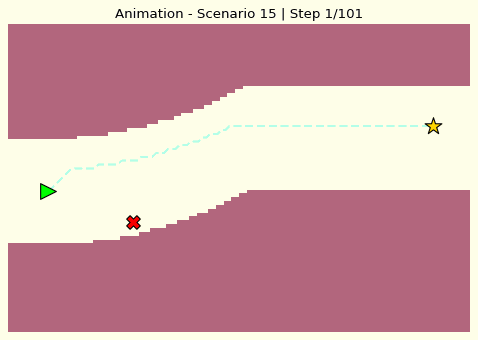

<div align="center">

# 🚗 NeuroDrive-K
**A Modular, Hybrid Framework for Autonomous Driving Systems**
[](https://www.python.org/)
[](#)
[](#)

A comprehensive autonomous driving simulation framework that integrates Machine Learning perception, Bayesian risk modeling, rule-based decision making, and A* path planning. This project satisfies the requirements for the **Introduction to AI (NMAI)** course.

---

## 📽️ Simulation Previews

| **Overtake Maneuver** | **Lane Change** |
|:---:|:---:|
|  |  |
| *Safely navigating around obstacles* | *Strategic positioning for traffic flow* |

| **Yield & Stop** | **Following Behavior** |
|:---:|:---:|
|  |  |
| *Responding to high-risk environments* | *Stable trajectory maintenance* |

---

## 🧠 Core AI Components

This system implements the mandatory 4-layer architecture for autonomous decision-making:

### 1. Representation & Search (L.O.1)
- **State Space**: 120x80 High-resolution Grid Map.
- **Algorithm**: **A* Search** with fallback logic.
- **Cost Function**: $Cost_{total} = Cost_{grid} + Cost_{lane\_penalty} + Cost_{manhattan\_heuristic}$.

### 2. Heuristics (L.O.1)
- **Manhattan Distance**: Optimized with a lane-bias weight to encourage staying in the center of the lane while making progress toward the goal.

### 3. Knowledge Representation (L.O.2.1)
- **IF-THEN Behavioral Rules**: Hard-coded safety constraints (e.g., buffer zones around obstacles, traffic laws).
- **Tactical Logic**: Automated goal-setting based on predicted maneuvers (e.g., shifting target lane for overtaking).

### 4. Bayesian Probability (L.O.2.2)
- **Bayesian Log-Odds Update**: Dynamically updating environmental risk based on weather, road surface, and visibility.
- **Uncertainty Modeling**: Handling noisy sensor data to estimate a robust "Final Cost Map".

### 5. Perception ML (L.O.3)
- **Ensemble Learning**: Random Forest and Gradient Boosting models for behavior classification and risk regression.
- **Explainability**: Integrated **SHAP** analysis to visualize feature importance.

---

## 📂 Project Structure

```
Autonomous_Driving_NMAI/
├── data/                       # Raw and source datasets
├── features/                   # Preprocessed & engineered features
├── models/                     # Saved ML models (PKL files)
├── modules/                    # Core logic components
│   ├── bayes.py                # Bayesian risk logic
│   ├── feature_engineering.py   # Physics-based feature creation
│   ├── knowledge_base.py        # Grid Map & Cost aggregation
│   ├── path_planner.py         # A* algorithm & Fallback planner
│   ├── perception_ml.py        # ML training & inference
│   ├── rule_based.py           # Safety rules & tactical goals
│   └── visualizer.py           # GIF & Plot generation
├── visualize/                  # Generated plots and GIFs
├── main.py                     # Entry point & Pipeline orchestrator
├── requirements.txt            # System dependencies
└── README.md                   # Project documentation
```

---

## 🚀 Getting Started

### Installation
1. Clone the repository and navigate to the project folder.
2. Install dependencies:
```bash
pip install -r requirements.txt
```

### Execution
Run the end-to-end pipeline (Preprocessing -> Training -> Simulation):
```bash
python main.py
```

---

## 📊 Results & Explainability

The system generates a detailed **SHAP Importance Plot** in the `visualize/` folder, explaining which physical factors (like TTC or Kinetic Danger) most influenced the AI's behavior predictions.


---
<div align="center">
Developed for the <b>Nhập môn AI (NMAI)</b> Course.
</div>
