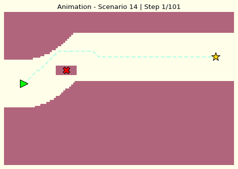
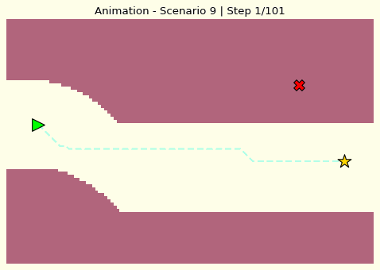
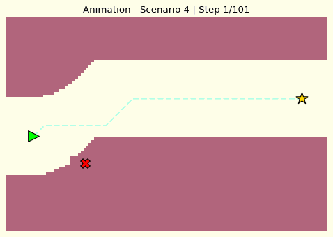
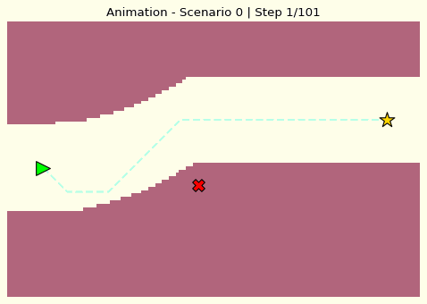
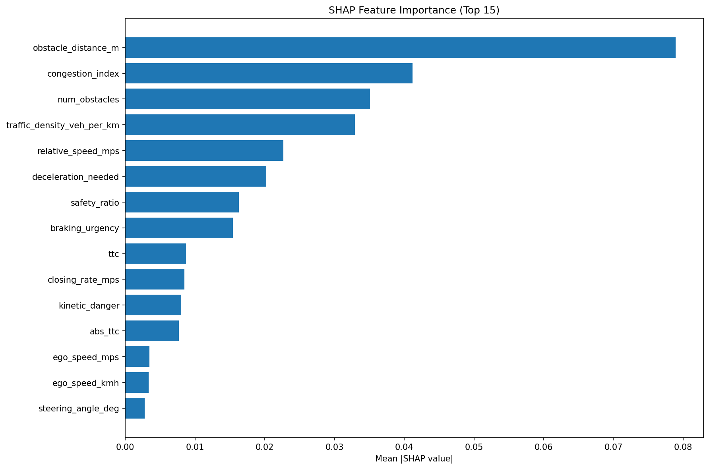

<div align="center">

# 🚗 NeuroDrive-K
**A Path Planning Modular Framework for Autonomous Driving Systems**


[](https://www.python.org/)
[](#)
[](#)

A comprehensive autonomous driving simulation framework that integrates Machine Learning perception, Bayesian risk modeling, rule-based decision making, and A* path planning. This project satisfies the requirements for the **Introduction to Artificial Intelligence** course.
</div>

---

## 🎓 Course Information
- **Course Name**: Introduction to Artificial Intelligence
- **Course Code**:  CO3061
- **Semester**: Semester 2, Academic Year 2025–2026
- **Instructor**: Dr. Truong Vinh Lan

## 👥 Team Members
| No. | Full Name | Student ID | Email |
|:---:|:---|:---:|:---|
| 1 | Nguyen Dang Khoa | 2352570 | khoa.nguyen2352570@hcmut.edu.vn |
| 2 | Nguyen Tran Gia Bao | 2352103 | bao.nguyenkunne@hcmut.edu.vn |
| 2 | Nguyen Viet Hung | 2352442 | hung.nguyenviet@hcmut.edu.vn |
| 2 | Le Duy Nhat Minh | 2352740 | minh.leduy@hcmut.edu.vn |

---

## 🎯 Project Goal
The objective of this project is to build a robust autonomous driving decision-making pipeline. It integrates physics-based feature engineering, machine learning for behavior perception, Bayesian modeling for environment uncertainty, and A* search for safe trajectory planning.

## 📂 Project Structure
```
NeuroDrive-K/
├── notebooks/                  # Google Colab Notebooks
│   └── NeuroDrive_K_Colab.ipynb
├── modules/                    # Core logic (Python modules)
│   ├── bayes.py                # Bayesian risk logic
│   ├── feature_engineering.py   # Physics-based feature creation
│   ├── knowledge_base.py        # Grid Map & Cost aggregation
│   ├── path_planner.py         # A* algorithm & Fallback planner
│   ├── perception_ml.py        # ML training & inference
│   ├── rule_based.py           # Safety rules & tactical goals
│   └── visualizer.py           # GIF & Plot generation
├── data/                       # Raw and source datasets
├── features/                   # Preprocessed & extracted features (.h5/.npy)
├── models/                     # Saved ML models (PKL files)
├── reports/                    # Final PDF Report & EDA
│   └── Report_NMAI.pdf
├── visualize/                  # Generated plots and GIFs
├── main.py                     # Local entry point
├── requirements.txt            # Dependencies
└── README.md                   # Project documentation
```

---

## 🚀 Execution Instructions

### 1. Google Colab (Recommended)
You can run the entire pipeline directly on Google Colab without any local setup.
- **Colab Link**: [https://colab.research.google.com/drive/1M4f6ZbqryfChyGCJ5kK-6VaXZpTG68yJ]
- Follow the instructions in the notebook to download the data and run the simulation.

### 2. Local Environment
1. Clone the repository: `git clone https://github.com/khoadangnguyenn/NeuroDrive-K.git`
2. Install dependencies: `pip install -r requirements.txt`
3. Run the pipeline: `python main.py`

---

## 📽️ Simulation Previews

| **Overtake Maneuver** | **Lane Change** |
|:---:|:---:|
|  |  |
| *Safely navigating around obstacles* | *Strategic positioning for traffic flow* |

| **Yield & Stop** | **Following Behavior** |
|:---:|:---:|
|  |  |
| *Responding to high-risk environments* | *Stable trajectory maintenance* |

---

## 🧠 Core AI Components

This system implements the mandatory 4-layer architecture for autonomous decision-making:

### 1. Representation & Search (L.O.1)
- **State Space**: 120x80 High-resolution Grid Map.
- **Algorithm**: **A* Search** with fallback logic.
- **Cost Function**: $Cost_{total} = Cost_{grid} + Cost_{lane\_penalty} + Cost_{manhattan\_heuristic}$.

### 2. Heuristics (L.O.1)
- **Manhattan Distance**: Optimized with a lane-bias weight to encourage staying in the center of the lane while making progress toward the goal.

### 3. Knowledge Representation (L.O.2.1)
- **IF-THEN Behavioral Rules**: Hard-coded safety constraints (e.g., buffer zones around obstacles, traffic laws).
- **Tactical Logic**: Automated goal-setting based on predicted maneuvers (e.g., shifting target lane for overtaking).

### 4. Bayesian Probability (L.O.2.2)
- **Bayesian Log-Odds Update**: Dynamically updating environmental risk based on weather, road surface, and visibility.
- **Uncertainty Modeling**: Handling noisy sensor data to estimate a robust "Final Cost Map".

### 5. Perception ML (L.O.3)
- **Ensemble Learning**: Random Forest and Gradient Boosting models for behavior classification and risk regression.
- **Explainability**: Integrated **SHAP** analysis to visualize feature importance.

---

## 📊 Results & Explainability

The system generates a detailed **SHAP Importance Plot** in the `visualize/` folder, explaining which physical factors (like TTC or Kinetic Danger) most influenced the AI's behavior predictions.



---
<div align="center">
Developed for the <b>Introduction to Artificial Intelligence</b> Course.
</div>
